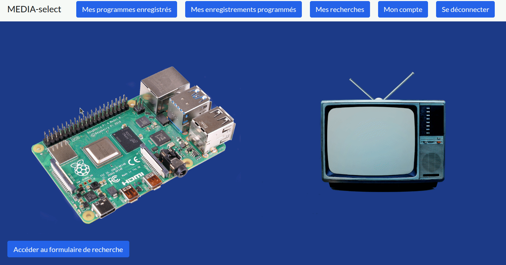
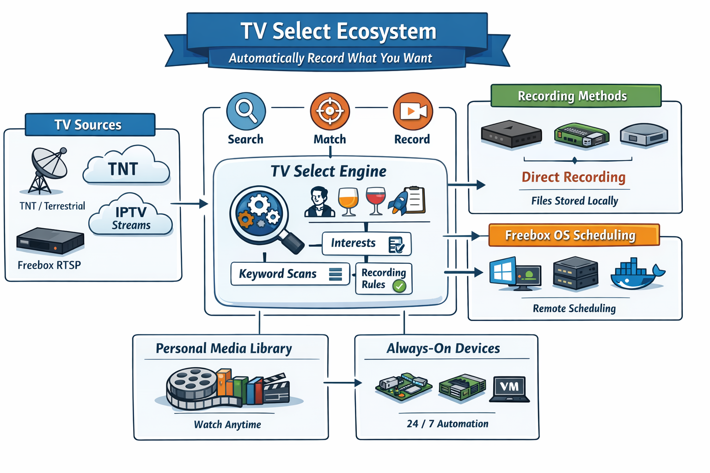

# 📺 TV Select Ecosystem

🚀 Open-source tools to turn TV into a personalized discovery engine

📼 Automatically find and record what matters to you

---

---

## 🎯 What is TV Select?

TV Select is an **open-source ecosystem** that transforms TV into a **personalized discovery system**.

No more scrolling.
No more missing interesting content.

👉 You define what you care about  
👉 The system finds it  
👉 And records it automatically  

---

## 🤯 The problem

You’ve probably experienced this:

* Endless channel surfing
* Programs you miss
* Content you didn't even know existed

TV isn’t built for discovery.
You don’t search it — you wait for it.

---

## 💡 The idea

What if TV worked like a search engine?

You tell it what you care about:

* wine 🍷  
* history 🏛️  
* space 🚀  

Or something more personal:

* a hard-to-find movie you’ve been waiting for 🎬
* all documentaries about tennis for your son 🎾

And it finds the content for you.

---

## ⚡ What happens next

You don’t have to do anything.

Behind the scenes, TV Select:

* 🔍 Scans all programs  
* 🎯 Detects matches  
* 📼 Records them automatically  

---

## 🍿 A few days later...

You open your library:

* a documentary about wine 🍷
* a history episode 🏛️
* a space report 🚀

And maybe:

* that rare movie you couldn’t find anywhere 🎬
* a tennis documentary your son will love 🎾

You didn’t search for them.
**They found you.**

---

## 💡 How it works

`Search → Match → Record → Watch`

* 🔍 Define your interests
* 🧠 Scan TV programs
* 📼 Record matching content
* 🎥 Watch anytime

👉 The web app is where you:

* define your interests (keywords, actors, topics)
* manage your searches
* get notified of new recordings

👉 The application (installed on your machine):

* retrieves recording instructions from the API
* triggers recordings automatically

---

## ✨ Why it’s different

* ❌ No recommendation algorithms
* ❌ No endless scrolling
* ❌ No passive consumption

✅ Just **your interests → your content**

---

## 🧠 The core idea

> 🧠 A system watches TV for you 24/7

TV Select turns TV from something you watch
into something that works for you.

---

## 🧰 Recommended setup

👉 **Always-on device (recommended)**

* Raspberry Pi
* Home server
* Virtual machine

---

## 🌐 Supported platforms

TV Select connects to multiple TV sources:

* 📡 TNT (terrestrial TV)
* 🌍 IPTV providers
* 📺 Freebox

---

# 🤔 Which version should I use?

## 🧭 Quick guide

| Use case                        | Recommended version                     |
| ------------------------------- | --------------------------------------- |
| 📡 Antenna (TNT / DVB-T)        | tvselect-fr                             |
| 🌐 Internet live streams        | tvselect-fr-live-stream                 |
| 📺 IPTV subscription            | iptvselect-fr                           |
| 🏠 Freebox (RTSP streams)       | mediaselect-fr                          |
| 🎯 Freebox OS (PC usage)        | select-freeboxos / select-freeboxos-win |
| 🤖 Freebox OS (24/7 automation) | select-freeboxos-sbc-vm                 |
| 🐳 Portable / cross-platform    | select-freeboxos-docker                 |

---

## 🧭 Quick mapping

| Application             | Web app         |
| ----------------------- | --------------- |
| tvselect-fr             | TV-select.fr    |
| tvselect-fr-live-stream | TV-select.fr    |
| iptvselect-fr           | IPTV-select.fr  |
| mediaselect-fr          | MEDIA-select.fr |
| select-freeboxos        | MEDIA-select.fr |
| select-freeboxos-win    | MEDIA-select.fr |
| select-freeboxos-sbc-vm | MEDIA-select.fr |
| select-freeboxos-docker | MEDIA-select.fr |

---

## 🧠 Recording vs Scheduling

💡 Projects are hosted across multiple repositories depending on their use case.

### 📼 Direct recording

- [tvselect-fr](https://github.com/tvselect/tvselect-fr)
- [tvselect-fr-live-stream](https://github.com/tvselect/tvselect-fr-live-stream)
- [iptvselect-fr](https://github.com/tvselect/iptvselect-fr)
- [mediaselect-fr](https://github.com/mediaselect/mediaselect-fr)

👉 Records videos on your machine

---

### 🎯 Freebox OS scheduling

- [select-freeboxos](https://github.com/mediaselect/select-freeboxos)
- [select-freeboxos-win](https://github.com/mediaselect/select-freeboxos-win)
- [select-freeboxos-sbc-vm](https://github.com/mediaselect/select-freeboxos-sbc-vm)
- [select-freeboxos-docker](https://github.com/mediaselect/select-freeboxos-docker)

👉 Your Freebox records the videos

---

## ⚖️ Choosing Freebox OS versions

| Situation               | Version                 |
| ----------------------- | ----------------------- |
| 🖥️ Linux PC             | select-freeboxos        |
| 🪟 Windows PC           | select-freeboxos-win    |
| 🔄 Always-on (SBC / VM) | select-freeboxos-sbc-vm |
| 🐳 Docker setup         | select-freeboxos-docker |

---

## ⚠️ Reliability considerations

* 📡 DVB-T → antenna signal
* 🌐 IPTV → provider stability
* 📺 RTSP → possible interruptions
* 🎯 Freebox OS → depends on system uptime

---

## 📦 Main projects

### 📡 TNT & Streaming

* tvselect-fr
* tvselect-fr-live-stream

### 🌍 IPTV

* iptvselect-fr

### 📺 Freebox

* mediaselect-fr
* select-freeboxos
* select-freeboxos-win
* select-freeboxos-sbc-vm
* select-freeboxos-docker

---

## 🚀 Get started

1️⃣ Choose your version  
2️⃣ Install it  
3️⃣ Define your interests  
4️⃣ Let it run  

👉 Your personal TV library builds itself

---

## 🧠 Philosophy

TV should adapt to you.
Not the other way around.

---

## ⭐ Contribute & support

* ⭐ Star the projects
* 🛠️ Contribute
* 💡 Share ideas

---

## ⚠️ Disclaimer

For personal use only.
Ensure compliance with your local laws.
